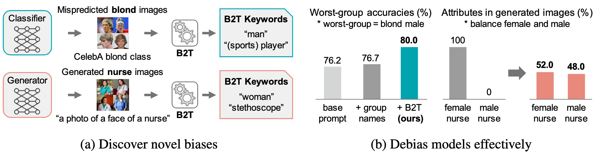
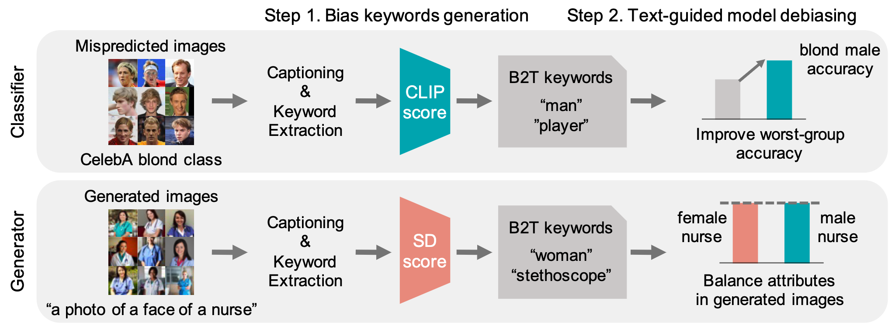

# On the reproducability of ["**Bias-to-Text: Debiasing Unknown Visual Biases through Language Interpretation**."](https://arxiv.org/abs/2301.11104)

On the reproducability of results and analyses presented in ["**Bias-to-Text: Debiasing Unknown Visual Biases through Language Interpretation**."](https://arxiv.org/abs/2301.11104)
B2T identifies and mitigates visual biases in image classifiers.


## Example Results

See the [**link**](./docs/more_results.MD) for more detailed results in bias discovery and debiasing.

## Method Overview



## Installation

Download datasets.
- [CelebA](http://mmlab.ie.cuhk.edu.hk/projects/CelebA.html)
- [Waterbirds](https://nlp.stanford.edu/data/dro/waterbird_complete95_forest2water2.tar.gz) (direct downloadable link), formed from Caltech-UCSD Birds 200 + Places

Clone our repository.  
```bash
$ git clone https://github.com/koenveldhorst/FACT25.git
```

Run below to create virtual ```conda``` environment for ```b2t```  and install all prerequisites.
```bash
$ conda env create -f b2t_environment.yaml
```

Activate the conda environment before running experiments.
```bash
$ source activate b2t
```

To run our code, you need to place datasets and model checkpoints to the right directory.  
You can download the ClipCap pretrained model [here](https://github.com/rmokady/CLIP_prefix_caption) and place the model to ```[root_dir]/function```. (Note that our paper uses the model that trained on Conceptual Captions)  
The main point of entry to the code is ```b2t.py```

## Arguments
- ```dataset```: ```celeba``` or ```waterbird```
- ```model```: download pretrained checkpoints of CelebA and Waterbirds [here](https://worksheets.codalab.org/worksheets/0x621811fe446b49bb818293bae2ef88c0) and put them into ```[root_dir]/model```    
  - [best_model_CelebA_erm.pth](https://worksheets.codalab.org/rest/bundles/0x227a9d64524a46e29e34177b8073cb44/contents/blob/logs/best_model.pth)
  - [best_model_CelebA_dro.pth](https://worksheets.codalab.org/rest/bundles/0xa7c89242d1c1442d8c9b94902469ba15/contents/blob/logs/best_model.pth) 
  - [best_model_Waterbirds_erm.pth](https://worksheets.codalab.org/rest/bundles/0x677545cb487b4c98831e70b16ff836e7/contents/blob/logs/best_model.pth)
  - [best_model_Waterbirds_dro.pth](https://worksheets.codalab.org/rest/bundles/0x365690114c2e4b369c489314fdae7e99/contents/blob/logs/best_model.pth)
- ```extract_caption```: ```True``` or ```False```
  - If set ```True```, automatically generate ```[root_dir]/data/[dataset]/caption/``` and store extracted captions there
- ```save_result```: ```True``` or ```False```
  - If set ```True```, automatically generate ```[root_dir]/diff/``` and store csv file of results there

## CelebA
Our code expects the CelebA dataset to be installed in the ```[root_dir]/data/celeba``` directory

A sample command to run ```b2t``` on CelebA with pretrained erm model is:
```bash
$ python b2t.py --dataset celeba --model best_model_CelebA_erm.pth
```

To extract captions from CelebA with pretrained erm model:
```bash
$ python b2t.py --dataset celeba --model best_model_CelebA_erm.pth --extract_caption
```

## Waterbirds
Our code expects the following files/folders in the ```[root_dir]/data/cub``` directory:
- ```data/waterbird_complete95_forest2water2/```

A sample command to run ```b2t``` on Waterbirds with pretrained erm model is:
```bash
$ python b2t.py --dataset waterbird --model best_model_Waterbirds_erm.pth
```
## ImageNet, ImageNet-C, ImageNet-R
Our code expects the ImageNet datasets to be stored in the file structure as described in ```data/imagenet.py```.

## Other Datasets and Models
You can run ```b2t``` on other datasets too with different models pretrained on ImageNet using the following sample commands:
```bash
$ python b2t.py --dataset imagenet --model imagenet-ViT
$ python b2t.py --dataset imagenet --model imagenet-resnet50
```


## Plotting
Several figures for CLIP scores, ROC curves, and the correlation between AUC and CLIP scores, are already included in the ```/plotting``` folder.
To generate these figures, first run b2t.py for the corresponding dataset and class to generate the necessary result and keyword files. 
use the following sample commands:
```bash
$ python plotting_fig3.py --dataset imagenet --class_label 'ant, emmet, pismire'
$ python plotting_fig3.py --dataset imagenet --class_label 'horizontal bar, high bar'
$ python plotting_fig3.py --dataset imagenet --class_label 'stethoscope'
$ python plotting_fig3.py --dataset imagenet --class_label 'monastery'
$ python plotting_fig3.py --dataset imagenet --class_label 'laptop, laptop computer'
$ python plotting_fig3.py --dataset imagenet --class_label 'killer whale, killer, orca, grampus, sea wolf, Orcinus orca'

$ python plotting_fig3.py --dataset waterbird --class_label waterbird
$ python plotting_fig3.py --dataset waterbird --class_label landbird

$ python plotting_fig3.py --dataset celeba --class_label blond
$ python plotting_fig3.py --dataset celeba --class_label 'not blond'
```

## Debiasing classifiers with B2T
<!-- To reproduce the debiasing classifier experiments, see [b2t_debias](b2t_debias).   -->
To reproduce the debiasing classifier experiments, see the following instructions.


For inferring group labels, run the following command.
```bash
$ python infer_group_label.py --data_dir [PATH TO DATASET] --dataset [DATASET] --save_path pseudo_bias/[DATASET].pt
```

To train debiased classifiers with GroupDRO using ground truth group label, run following script. 

```bash
$ bash gdro/scripts/run_dro_[DATASET].sh [PATH TO DATASET] [SEED]
```

To train debiased classifier using B2T inferred group labels, run following script. 

```bash
$ bash gdro/scripts/run_dro_[DATASET]_b2t.sh [PATH TO DATASET] [SEED]
```

Sample commands to do the aforementioned experiments:
```bash
$ python infer_group_label.py --data_dir "data/cub/data/waterbird_complete95_forest2water2" --dataset waterbirds --save_path b2t_debias/pseudo_bias/waterbirds.pt
$ python infer_group_label.py --data_dir "data/celeba" --dataset celeba --save_path b2t_debias/pseudo_bias/celeba.pt

$ bash b2t_debias/gdro/scripts/run_dro_waterbirds_b2t.sh "data/cub/data/waterbird_complete95_forest2water2" 380
$ bash b2t_debias/gdro/scripts/run_dro_celeba_b2t.sh "data/celeba" 164
```

<!-- ## Diffusion models with B2T
To reproduce the diffusion model experiments, see [b2t_diffusion](b2t_diffusion).   -->
